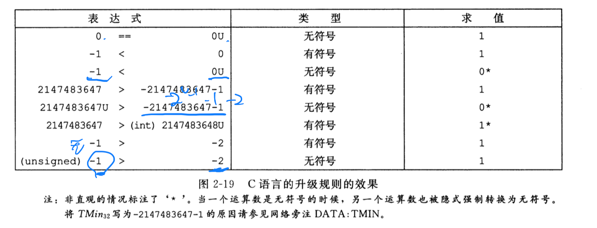
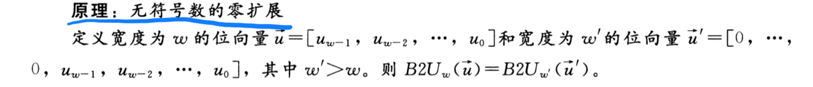
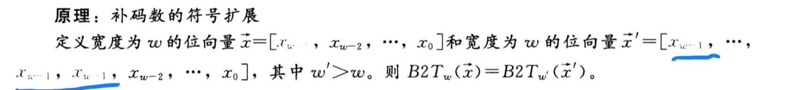

# 信息的表示和处理

孤立的讲，单个的**位**不是非常有用。然而，当把位组合在一起，再加上某种**解释**，即赋予不同的可能位模式以含义，就能够表示任何有限集合的元素

我们研究三种最重要的数字表示：无符号编码，补码编码和浮点数编码

- **无符号编码**：基于传统的二进制表示法，表示大于或等于零的数字
- **补码编码**：有符号整数的最常见的表示方式，有符号整数就是可以为正或者为负的数字
- **浮点数编码**：表示实数的科学记数法的以 2 为基数的版本

- 小端法：最低有效字节在最前面的方式
- 大端法：最高有效字节在最前面的方式

## C 语言中的有符号数与无符号数

C 语言支持所有整型数据类型的有符号和无符号运算。尽管 C 语言标准没有指定有符号数要采用某种表示，但是几乎所有的机器都是使用**补码**。通常，大多数数字都是默认有符号的。

数据类型转换有如下两种：

- 显式的**强制类型转换**就会导致转换发送，比如如下代码：

  ```C
  int tx, ty;
  unsigned ux, uy;

  tx = (int) ux;
  ty = (unsigned) uy;
  ```

- **隐式类型转换**，当一种类型的表达式被赋值给另外一种类型的变量时，转换是隐式发生的，如下：

  ```C
      int tx, ty;
      unsigned ux, uy;

      tx = ux; // 无符号数ux转换为int类型
      uy = ty; // 有符号数ty转换为无符号数
  ```

如下代码：

```C
#include <stdio.h>

int main()
{
    int x = -1;
    unsigned u = 2147483648;

    printf("x = %u = %d\n", x, x);
    printf("u = %u = %d\n", u, u);
    return 0;
}

```

上面代码运行打印为：

```shell
x = 4294967295 = -1
u = 2147483648 = -2147483648
```

由于 C 语言对同时包含有符号数和无符号数表达式的处理方式，出现了一些奇特的行为。当执行一个运算时，如果它的一个运算数是有符号的，而另一个运算数是无符号的，那么 C 语言会隐式地将**有符号参数强制转换为无符号数**，并假设这两个数都是非负的。



### 2.2.6 扩展一个数字的位表示

一个常见的运算是在**不同字长的整数**之间转换，同时又保持数值不变

- **无符号数**转换为一个更大的数据类型，只需要在表示的开头添加 0，这种运算被称为**零扩展**
  

- 将一个**补码**数字转换为一个更大的数据类型，执行为**符号扩展**，在表示中添加**最高有效位**的值
  

📢 注意：从一个数据大小到另一个数据大小的转换，以及无符号和有符号数字之间的转换的相对顺序能够影响一个程度的运行，比如以下代码：

```C
    short sx = -12345;
    unsigned uy = sx; // 将short有符号类型数字转换为int无符号类型

    printf("uy = %u:\t", uy); // uy = 4294954951: c7 cf ff ff
    show_bytes((byte_pointer)&uy, sizeof(unsigned));
```

上面的代码是先将`short`转换为`int`类型，然后再将有符号数转换为无符号数，也就是说`(unsigned) sx` 等价于 `(unsigned)(int) sx`，求值得到 4294954951，而不是`(unsigned int)(unsigned short) sx`，该表达式求值为 53191

### 2.2.7 截断数字

当减少一个数字的位数，如下

```C
    int x = 53191;
    short sx = (short)x; // 4 位强制转换为 2 位数字，去掉前面的 0，第一位符号位为 1，则转换位负数
    int y = sx; // 2 位数字转换位 4 位，符号数扩展添加符号位，则在前面一直添加符号位 1，所以还是转换为负数

    printf("x = %d", x);   // 53191
    printf("sx = %d", sx); // -12345
    printf("y = %d", y);   // -12345
```

当一个 `w` 位的数截断为一个 `k` 位数字时，会丢弃高 `w - k` 位，截断一个数字可能会改变它的值--溢出的一种形式。

### 表示字符串

在 c 语言中字符串被编码为一个以`null`（其值为 0）字符结尾的**字符数组**，每个字符都由某个标准编码来表示，最常见的是`ASCII`字符码
