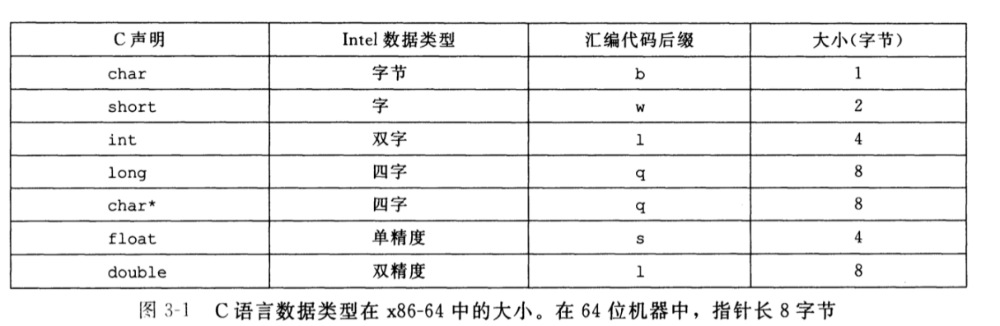
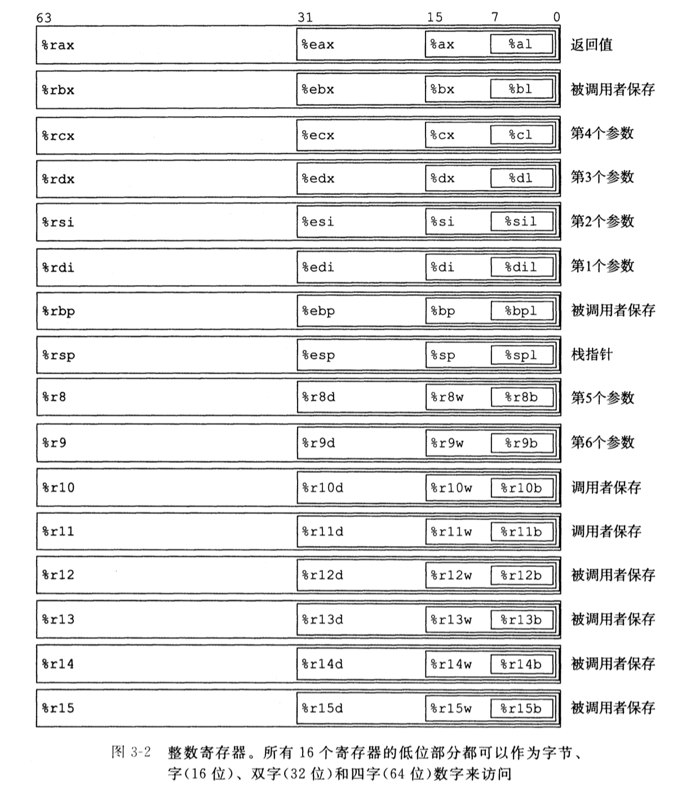
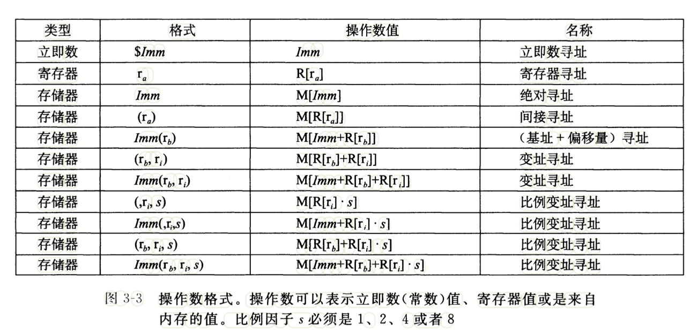

# 程序的机器级表示

计算机执行**机器代码**，用字节序列编码低级的操作，包括处理数据、管理内存、读写存储设备上的数据，以及利用网络通信

GCC C 语言编译器以**汇编代码**的形式产生输出,**汇编代码**是机器代码的文本表示，给出程序中的每一条指令, 然后 GCC 调用**汇编器**和**链接器**，根据汇编代码生成可执行的机器代码

用高级语言编写的程序可以在很多不同的机器上编译和执行，而汇编代码则是与特定机器密切相关的

## 程序编码

```bash
gcc -Og -o p p1.c p2.c
```

上面是一条编译 c 程序文件的指令，编译选项`-Og`告诉编译器使用会生产符合原始`C`代码整体结构的机器代码的优化等级。使用较高级别优化产生的代码会严重变形，以至于产生的机器代码和初始源代码之间的关系非常难以理解。实际上，从得到的程序的性能考虑，较高级别的优化，例如`-O1`， `-O2`被认为是较好的选择

C 预处理器扩展源代

```flow
st=>start: 开始

op1=>operation: 扩展源代码，插入所有用#include命令指定的文件，并扩展所有用#define声明指定的宏
op2=>operation: 编译器产生源文件的汇编代码
op3=>operation: 汇编器会将汇编代码转化为二进制目标代码文件
op4=>operation: 链接器将目标代码问价与实现库函数(printf)代码合并，生产最终可执行代码文件
e=>end: 结束
st->op1->op2->op3->op4->e

```

- 目标代码：目标代码是机器代码的一种形式，它包含所有指令的二进制表示，但是还没有填入全局值的地址，所有后面会有最后一步**链接**操作

### 机器级代码

对于机器级编程来说，其中两种抽象尤为重要

- 由**指令集体系结构或指令级架构**来定义机器级程序的格式和行为，它定义了处理器状态、指令的格式、以及每条指令对状态的影响
- 机器级程序使用的内存地址是**虚拟地址**，提供的内存模型看上去是一个非常大的字节数组

---

X86-64 的机器代码和原始的 C 代码差别非常大。一些通常对 C 语言程序员隐藏的处理器状态都是可见的

- **程序计数器 PC**：在`x86-64`中用`%rip`表示，给出将要执行的下一条指令在内存中的地址
- 整数寄存器：包含 16 个命名的位置，分别存储 64 位的值。这些寄存器可以存储地址或整数数据。有的寄存器被用来记录某些重要的程序状态，而其他寄存器用来保存临时数据。例如过程的参数和局部变量，以及函数的返回值
- 条件码寄存器：保存着最近执行的算术或逻辑指令的状态信息。它们用来实现控制或数据流中的条件变化，比如用来实现`if`和`while`语句
- 向量寄存器：一组向量寄存器可以存放一个或多个整数或浮点数值

虽然 C 语言可以在内存中声明和分配各种数据类型对象，但是机器代码只是简单地将内存看成一个很大的、按字节寻址的数组。C 语言中的聚合数据类型，例如数组和数据结构，在机器代码中用一组连续的字节表示。即使是对标量数据类型，汇编代码也不区分有符号或无符号整数，不区分各种类型的指针，甚至不区分指针和整数

---

程序内存包含：

- 程序的可执行代码
- 操作系统信息
- 管理过程调用和返回的运行时栈
- 用户分配的内存块（用`malloc`库函数分配的）

程序内存用**虚拟地址**来寻址。在任意给定的时刻，只有有限的一部分虚拟地址被认为是合法的。操作系统负责管理虚拟地址控件，将**虚拟地址翻译成实际处理器内存中的物理地址**

下面是一段 C 语言代码`mstore.c`

```c
long mult2(long, long);

void multstore(long x, long y, long *dest) {
    long t = mult2(x, y);
    *dest = t;
}
```

执行`gcc -Og -S mstore.c`将其转变为汇编代码，这段代码已经除去了所有关于局部变量名或数据类型的信息

```bash
_multstore:                             ## @multstore
 .cfi_startproc
## %bb.0:
 pushq %rbp  ## 将寄存器%rbp的内容压入栈中
 movq %rsp, %rbp
 pushq %rbx
 pushq %rax
 movq %rdx, %rbx
 callq _mult2 ## 调用_mult2函数
 movq %rax, (%rbx)
 addq $8, %rsp
 popq %rbx
 popq %rbp
 retq
                                        ## -- End function
```

使用`gcc -Og -c mstore.c`，编译器会编译并汇编该代码，会产生目标文件`mstore.o`.里面有一段序列就是上面所列出的汇编指令对应的目标代码。由此可得，机器执行的程序只是一个字节序列，它是对一系列指令的编码。机器对产生这些指令的源代码一无所知

---

**反汇编器**：查看机器代码文件的内容，会根据机器代码产生一种类似于汇编代码的格式`objdump -d mstore.o`, 结果如下:

```bash
$ objdump -d mstore.o

mstore.o: file format Mach-O 64-bit x86-64


Disassembly of section __TEXT,__text:

0000000000000000 _multstore:
       0: 55                            pushq %rbp
       1: 48 89 e5                      movq %rsp, %rbp
       4: 53                            pushq %rbx
       5: 50                            pushq %rax
       6: 48 89 d3                      movq %rdx, %rbx
       9: e8 00 00 00 00                callq 0 <_multstore+0xe>
       e: 48 89 03                      movq %rax, (%rbx)
      11: 48 83 c4 08                   addq $8, %rsp
      15: 5b                            popq %rbx
      16: 5d                            popq %rbp
      17: c3                            retq
```

左边是二进制指令，右边是对应的汇编语言

## 3.3 数据格式

由于是从 16 位体系结构扩展成 32 位的，`Intel`用术语"字（word）"表示 16 位数据类型。因此，称 32 位数为“双字（double words）”，64 位为“四字（quad words）”



浮点数主要有两种形式：

- 单精度（4 字节）值，对应于 C 语言数据类型`float`
- 双精度（8 字节）值，对于 C 语言数据类型`double`

如上图所示，大多数`GCC`生成的汇编代码指令都有一个字符的后缀，表明操作数的大小，列入：数据传送指令有四种：`movb`（传送字节），`movw`（传送字），`movl`（传送双字），`movq`（传送四字），后缀`l`表示双字，因为 32 位数被看成是“长字”(`long word`)

注意 📢：汇编代码也使用后缀`l`来表示 4 字节整数和 8 字节双精度浮点数

## 3.4 访问信息

一个 x86-64 的中央处理单元(CPU)包含一组 16 个存储 64 位值的**通用目的寄存器**，这些寄存器用来存储整数数据和指针，如下：



如上图嵌套的方框标明的，指令可以对这 16 个寄存器的低位字节中存放不同大小的数据进行操作，字节级操作可以访问最低的字节，16 位操作可以访问最低的 2 个字节，32 位操作可以访问最低的 4 个字节，而 64 位操作可以访问整个寄存器

在常见的程序中不同的寄存器扮演不同的角色。其中最特别的是栈指针`%rsp`，用来指明运行时栈的结束位置。有些程序会明确地读写这个寄存器。另外 15 个寄存器的用法更加灵活。少量指令会使用某个特定的寄存器

### 3.4.1 操作数指示符

源数据值可以以**常数**形式给出，或者是从**寄存器**或**内存**中读出。结果可以存放在**寄存器**或**内存**中。因此，各种不同的操作数的可能性被分为三种类型：

- 第一种类型是**立即数**，用来表示常数值，立即数的书写方式是`$`后面跟一个用标准 C 表示法表示的整数，比如`$-577`或`$0x1F`。
- 第二种类型是**寄存器**，它表示某个寄存器的内容，16 哥寄存器的低 1 字节，2 字节，4 字节或 8 字节中的一个作为操作数，下面用`r`来表示寄存器，用引用`R[r]`来表示它的值，这是将寄存器集合看着一个数组`R`，用寄存器标识符作为索引
- 第三中类型是**内存引用**，它会根据计算出来的地址（通常称为有效地址）访问某个内存位置。因为将内存看成一个很大的字节数组，我们用符号`M[Addr]`表示对存储在内存中从地址`Addr`开始的 b 个字节值的引用


