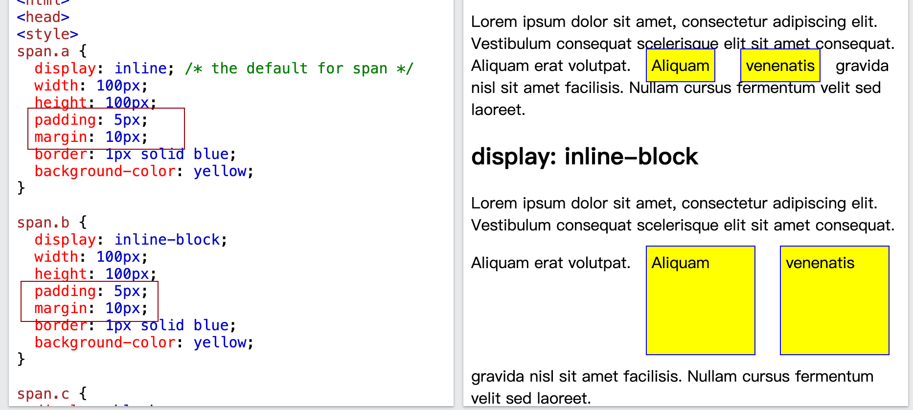
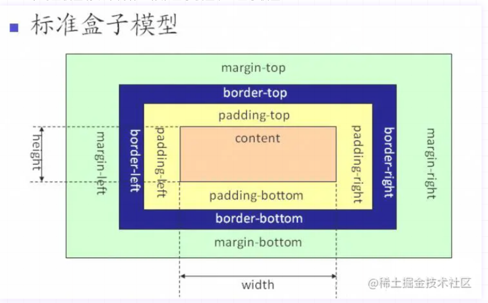
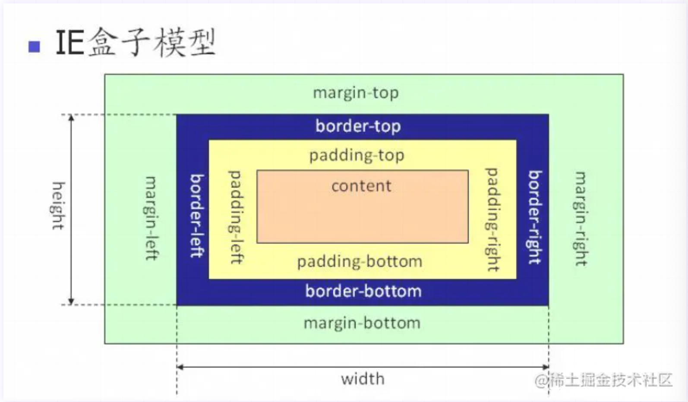
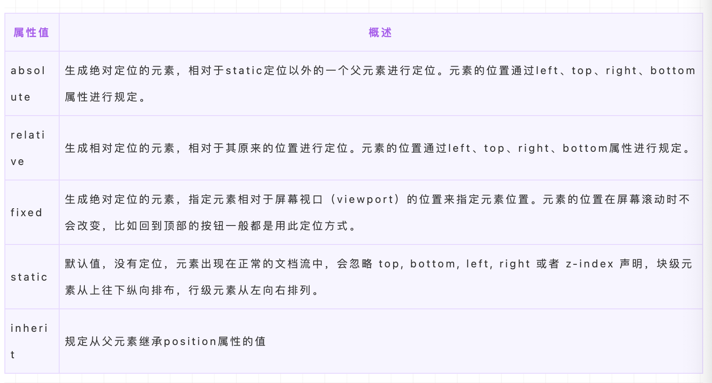
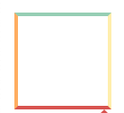
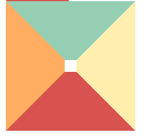
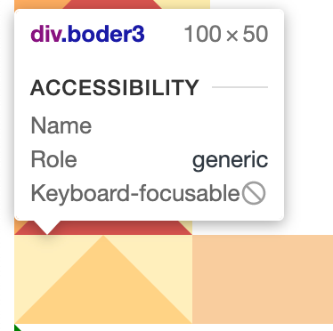
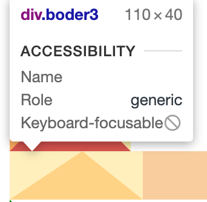
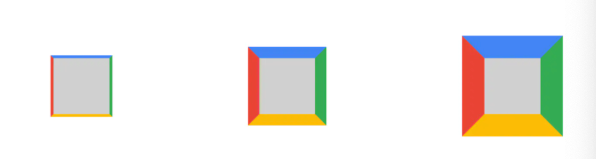

# `css`相关的笔记以及`demo`

- [盒模型以及相关样式](box-model.md)
- [`flex`布局](flex.md)
  - [`demo`](flex.html)
- `grid`布局
  - [`demo`](grid.html)
- [`background`](background.md)
  - [`demo`](background.html)

## display的属性值以及作用

- `block`: 单独占据一行，多个元素会另起一行，可以设置`width`，`height`，`margin`以及`padding`属性
- `inline`: 元素不单独占据一行，设置`width`，`height`无效，宽高由内容决定，可以设置`paddinng`，但只能设置水平方向的`margin`不能设置垂直方法的`margin`
- `line-block`：可以设置宽高，同行显示



## 隐藏元素的方法和区别

- `display: none`: 渲染树不会包含该渲染，不会在页面中占据位置，也不会响应绑定的监听事件
- `visibility: hidden`: 渲染树包含该节点的渲染，会在页面占据空间，不会响应绑定的监听事件
- `opacity: 0`: 设置元素透明度为0，会在页面占据空间，能响应绑定的监听事件
- `position: absolute`: 通过使用绝对定位将元素移除可视区域，实现元素yinc
- `z-index: 负值`: 使用其他元素遮盖住该元素，依次来实现隐藏
- `clip/clip-path`: 使用元素裁剪的方法来实现元素的隐藏，会在页面内占据位置
- `transform: scale(0, 0)`: 将元素缩放为0, 仍在页面占据位置

## `display: none`与`visibility：hidden`的区别

- 渲染区别： `display: none`不在渲染树中，不占据位置，`visibility: hidden`在渲染树中，占位位置
- 继承区别：`display: none`是非继承属性，子孙节点会随着父节点消失，`visibility: hidden`是继承属性，可以通过设置`visibility: visible`让子孙节点显示
- 重排区别：修改`display`通常会造成文档的重排，但是修改`visibility`只会造成本元素的重绘
- `display: none`的内容不会被读取，而`visibility: hidden`的内容可以被读取

## `link`与`@import`的区别

两者都是外部引用css的方式，区别如下：

- `link`是`HTML`标签，除了加载`css`之外，能可以加载其他事务，`@import`属于`css`语法，只能加载`css`
- `link`引用`css`时，可以多个文件同时加载，`@import`需要页面完全载入后加载
- `link`支持使用`js`去控制`DOM`样式，而`@import`不支持

## 伪类与伪元素

**伪类**用于当元素处于某个状态时，为其添加对应的样式，这个状态是根据用户行为而动态变化的，比如`:hover`，`visited`等等

**伪元素**用于创建一些不在文档树中的元素，并为其添加样式，比如`:before`，`:after`

css3规范中要求使用双冒号::表示伪元素，使用单冒号表示伪类

## `requestAnimationFrame`

`requestAnimationFrame(callback)`是浏览器在**下一次重绘之前更新动画帧所调用的函数**，该方法属于宏任务，会在微任务执行之后再去执行，可以使用`cancelAnimationFrame`来取消执行动画

有以下优点：

- CPU节能：使用`setInterval`实现的动画，会在页面被**隐藏**或**最小化**时，仍在后台执行动画任务，由于此时页面处于不可见或不可用状态，所以刷新动画是没有意义的。而`requestAnimationFrame`运行在后台标签页或被隐藏的`iframe`中时，会被暂停调用
- 函数节流：在高频事件(onsize, onscroll)中，为了防止在一个刷新时间间隔内多次调用执行，可以使用`requestAnimationFrame`，因为它可以保证在每个刷新间隔内，回调函数只被执行一次
- 减少DOM操作：`requestAnimationFrame`会把每一帧中的所有`DOM`操作集中起来，在一次重绘回流中完成，并且频率与浏览器刷新频率一致

`setTimeout`的缺点：

- 执行时间比设定时间晚
- 其执行时间间隔不确定，容易引起丢帧
  
## 盒模型

- 标准盒模型: width = contentWidth, height = contentHeight
- IE盒模型: width = contentWidth + paddingLeft + paddingRight + border-left + border-right
可以使用`box-sizing: content-box/border-box`来修改，`content-box`为标准盒模型（默认值），`border-box`为IE盒模型




## 使用`transform： translate(x, y, z)`来改变位置

使用`transform`或`opacity`不会触发浏览器回流或重绘，只会触发复合，而改变绝对定位会触发重新布局，进而触发回流与重绘，`transform`使浏览器为元素创建一个GPU图层，但改变绝对定位会使用到CPU

## 响应式处理

## `css-loader`与`style-loader`

- `css-loader`会对`@import`和`url()`进行处理，就像`js`解析`import/requeire()`一样
- `style-loader`: 创建`style`标签，将`css`内容插入到`DOM`中
在使用时，`css-loader`的执行顺序一定要安排在`style-loader`的前面，只有完成了编译过程，才可以对`css`进行插入

## 如何判断元素是否到达可视区域

`element.offsetTop <= containerElement.innerHeight + element.scrollTop`

## 常见布局单位

- 像素(px)
- 百分比(%)：当浏览器的宽度和高度发生变化的时候，通过百分比单位可以使浏览器中的组件的宽高随着浏览器的变化而变化，从而实现响应式效果，**子元素的百分比相对于直接父元素**
- em/rem：相对长度单位，`em`相对于父元素，`rem`相对于跟元素 1em/rem = 16px
- vw/vh：与视图窗口有关的单位，`vw`相对于视图窗口的宽度，视窗高度是100vw，`vh`相对于视图窗口的高度，视窗高度是100vh

## 响应式布局
  
- 根据不同像素，使用css媒体查询，选择不同精度的图片，头部使用`meta`声明`viewport`

  ```html
  <meta name="’viewport’" content="”width=device-width," initial-scale="1." maximum-scale="1,user-scalable=no”"/>
  ```

- 适配不同屏幕大小，使用rem，em，vh，vw等相对单位

## BFC`

`BFC(Block Formatting Context)`，是页面可视化CSS渲染的一部分，是布局 过程中生成块级盒子的区域，也是浮动元素与其他元素的交互限定区域

也就是说，`BFC`是一个独立的布局容器，在这个容器中按照一定的规则对元素进行摆放，不会影响其他区域。如果一个元素符合触发`BFC`的条件，则`BFC`中的布局元素不受外部影响

创建`BFC`的条件：

- 根元素：`body`
- 设置浮动：`float`除`none`之外的值
- 设置绝对定位：`position`属性值`absolute`，`fixed`
- `display`值为`inline-block`，`table`，`flex`，`grid`
- `overflow`值为`auto`, `hidden`, `scroll`

作用：

- 解决外边距重叠问题 ：由于BFC是一个独立的区域，内部的元素与外部元素互不影响，将两个元素变为两个BFC，可以解决margin的重叠问题
- 解决浮动高度塌陷问题

## `position`的属性有哪些，区别是什么？



### `absolute`与`fixed`的区别

- 共同点:
  - 改变行内元素的呈现方式，将`display`设置为`inline-block`
  - 使元素脱离文档流，不再占位位置
- 不同点：
  - `absolute`相对于值不为`static`的父元素，`fixed`相对于浏览器
  - 在有滚动条的页面中，`absolute`会跟着父元素进行移动，`fixed`固定在页面的具体位置

### `sticky`定位

`sticky`意为粘性定位，基于用于的滚动位置来进行定位，在`position: relative`与`posiion:fixed`之间切换，它的行为就像`position:relative` 而当页面滚动超出目标区域时，它的表现就`position:fixed`，会固定在目标位置。元素定位表现为在跨越特定阈值前为相对定位，之后为固定定位。这个特定阈值指的是 top, right, bottom 或 left 之一，换言之，指定 top, right, bottom 或 left 四个阈值其中之一，才可使粘性定位生效。否则其行为与相对定位相同。

### `css如何画一个三角形，原理是什么`

在`css`中设置一个盒模型

```css
.boder {
    width: 50px;
    height: 50px;
    border: 2px solid;
    border-color: #96ceb4 #ffeead #d9534f #ffad60;
}
```

上面的盒模型显示出来为下：

当我们减少内容的宽度，增加边框的宽度时

```css
.boder1 {
    width: 10px;
    height: 10px;
    border: 50px solid;
    border-color: #96ceb4 #ffeead #d9534f #ffad60;
}
```


白色区域为`wbiao`与`height`，此时显示为一个梯形，然后将该`width`与`height`逐渐变小，就可以显示出一个三角形

这个时候可以看到4个颜色不同的三角形，如果需要下方三角形，只需要将上、左、右边框的`color`设置为`tranparent`即可，但这种方式视觉上实现了三角形，但是隐藏的部分仍然占据了部分高度

```css
.boder3 {
    width: 0px;
    height: 0px;
    border-style: solid;
    border-width: 0 50px 50px;
    border-color: transparent transparent #ffad60;
}
```


可以看到这个向上的三角形，三角形的高度等于`border-bottom`，三角形的底边等于`border-left+border-right`，修改下值验证下：

```css
.boder3 {
    width: 0px;
    height: 0px;
    border-style: solid;
    border-width: 0 50px 40px 60px;
    border-color: transparent transparent #ffad60;
}
```


从上面的图可以看出，三角形的底长 = border-left + border-right = 50 + 60  = 110, 三角形的高 = border-bottom = 40

#### 原理分析

实际上边框并不是直线，将边框逐渐放大，可以得到每条边框都是一个梯形


## chrome怎么支持最小12px字体

chrome中文版浏览器会默认设定页面的最小字号是12px，英文版没有限制
解决方案：

- `zoom`：变焦，改变页面上元素的尺寸，属于真实尺寸，值可以是50% 或者 0.5 表示缩小到原来一半，需要考虑兼容性
- `-webkit-transform:scale()`： 缩放，只对可以宽高的元素生效，也就是`block`以及`inline-block`的元素
- `-webkit-text-size-adjust: none`：设定文字大小是否根据浏览器自动调整显示大小，不建议全局设置，因为不会随着网页放大而放大了。`chrome 27版本`之后不支持了

## css性能优化

css的优化主要是有以下几种方式：

1. 内联首屏关键css
2. 异步加载css
3. 资源压缩
4. 合理使用选择器
5. 减少使用昂贵的属性
6. 不要使用`@import`

### 内联首屏关键css

首页的内容加载速度影响这用户体验，而通过内联`css`关键代码可以使浏览器在下载完`html`后立即就能渲染，而外部引用`css`代码，则需要解析`html`结构遇到外部`css`文件，才会开始下载，内联`css`可以将渲染的时间提前

### 异步加载css

在css文件请求，下载，解析完成之前，会阻塞页面的渲染，这个时候就可以使用异步加载方案

### 合理使用选择器

css匹配的规则是从右往左开始匹配，例如#markdown .content h3匹配规则如下：

- 先找到h3标签元素
- 去除祖先不是.content的元素
- 去除祖先不是#markdown的元素
嵌套层级多的话，匹配所要花费的时间就更多，可以遵循下面的规则

1. 不要嵌套使用过多的选择器
2. 通配符以及属性选择器效率低，避免使用

### 减少使用昂贵的属性

减少使用会产生回流的属性

### 不要使用`@import`

css样式文件有两种引入方式，一种是`link`元素，另一种是`@import`，`link`元素是并行下载，而`@import`是同步的，增加加载时间，比如一个css文件`index.css`中引入了`reset.css`，那么浏览器需要先下载`index.css`，然后解析之后，再下载`reset.css`

## 回流跟重绘


参考：

- [web前端-面试官系列](https://vue3js.cn/interview/css/triangle.html#%E4%BA%8C%E3%80%81%E5%AE%9E%E7%8E%B0%E8%BF%87%E7%A8%8B)
