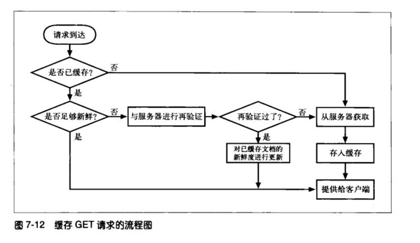

# 缓存

由于带宽，距离以及冗余数据等原因，使重复数据在网络中被多次请求是不明智的。因此可以使用缓存来保存一个副本

## 命中和未命中的

缓存命中：用已有的副本为某些到达缓存的请求提供服务
缓存未命中：达到的缓存的请求可能会由于没有副本可用，而被转发给原始服务器

### 再验证

原始服务器的内容可能发生变化，缓存要不时对其进行检测，看它们报错的副本是否仍是服务器上最新的副本。这些"新鲜度检测"被称为HTTP再验证

为了有效的进行再验证，HTTP定义了一些特殊的请求，不用从服务器上获取整个对象，就可以快速检测出内容是否是最新的

缓存可以在任意时刻，以任意的频率对副本进行再验证。但由于缓存中通常会包含数百万的文档，并且带宽非常珍贵，所以大部分缓存只有在客户端发起请求，并且副本旧的足以需要检测时，才会对副本进行验证

再验证命中/缓慢命中: 缓存对缓存的副本进行再验证，会向原始服务器发送一个小的再验证请求。如果内容没有变化，服务器会以一个小的`304 Not Modified`进行响应。只要缓存知道副本仍然有效，就会**再次**将副本标识为暂时新鲜的（这种方式要与原始服务器进行核对，会比单纯的缓存命中要慢，但它没有从服务器中获取对象数据，所以比缓存未命中要快）

用来对已缓存对象进行再验证的首部，最常用的是`If-Modified-Since`

下面列出了3中情况下服务器收到`If-Modified-Since`请求时发生的情况:
- 再验证命中，服务器对象未被修改，服务器向客户端发送小的`HTTP`的`304 Not Modified`响应
- 再验证未命中，服务器对象与已缓存副本不同，服务器向客户端发送一条普通的，带有完整内容的`HTTP 200 OK`响应
- 对象被删除，服务器对象已被删除，服务器就返回一个`404 Not Found`响应，缓存也会将其**副本删除**

### 区分命中与未命中的情况

`HTTP`没有为用户提供一种手段来区分响应式缓存命中的，还是访问原始服务器得到的。这两种情况下，响应码都是`200 OK`

有些商业代理缓存会在`Via`首部附加一些额外信息，以描述缓存中发生的情况

客户端有一种方法可以判断响应是否来自缓存，就是使用`Date`首部。将响应中的`Date`首部的值与当前时间进行比较，如果响应中的日期值比较早，则可以认为这是一条缓存的响应

## 缓存的拓扑结构

缓存可以使单个用户专用的，也可以使数千名用户共享的
- 专用缓存，被称为私有缓存，是个人的缓存，包含了单个用户最常用的页面
- 共享缓存，被称为公有缓存，包含了某个用户团体的常用页面

### 私有缓存

### 公有缓存

公有代理缓存被称为缓存代理服务器，会从本地缓存中提供文档，或者代表用户与服务器进行联系。会接受来自多个用户的访问，通过它可以更好地减少冗余流量

### 代理缓存的层次结构

在较小的缓存中未命中的请求会被导向较大的父缓存，由它来为剩下的那些"提炼过的"流量提供服务

## 缓存的处理步骤

缓存对一条`HTTP`的`GET`报文的基本缓存处理过程包括7个步骤：
- 接收：缓存从网络中读取抵达的报文请求
- 解析：缓存对报文进行解析，提取出`URL`和各种首部
- 查询：缓存查看是否有本地副本可用，如果没有，就获取一份副本，并将其保存在本地
- 新鲜度检测：缓存查看已缓存副本是否足够新鲜，如果不是，就询问服务器是否有更新
- 创建响应：缓存会用新的首部和已缓存的主体来构建一条响应报文
- 发送：缓存通过网络将响应发回给客户端
- 日志：缓存可选地创建一个日志文件条目来描述这个事务

## 保持副本的新鲜

`HTTP`有一些简单的机制可以在不要求服务器记住有哪些缓存拥有其文档副本的情况下，保持已缓存数据与服务器数据之间的充分一致。`HTTP`将这些简单的机制称为**文档过期**和**服务器再验证**

### 文档过期
通过`HTTP`的`Cache-Control`首部和`Expires`首部，来控制文档的"过期日期"，在缓存文档过期之前，缓存可以以任意频率使用这些副本而无需与服务器联系

### 过期日期和使用期

- `HTTP/1.0+`的`Expires`首部
- `HTTP/1.1`的`Cache-Control: max-age`首部

上面的两个首部用来指定过期日期，两个首部本质所做的事情是一样的，区别如下

`Cache-Control: max-age`使用的是相对时间，`Expires`使用的是绝对日期(绝对日期依赖于计算机时钟的正确配置)

### 服务器再验证
缓存需要询问原始服务器文档是否发生了变化，这种情况被称为"服务器再验证"

- 如果再验证显示内容发生了变化，缓存会获取一份新的文档副本，并将其存储在旧文档的位置上，然后将文档发生给客户端
- 如果再验证显示内容没有发生变化，缓存只需要获取新的首部，包括一个新的过期日期，并对缓存中的首部进行更新

### 用条件方法进行再验证
`HTTP`允许缓存向原始服务器发送一个"条件GET"，请求服务器只有在文档与缓存中现有的副本不同时，才回送对象主体

- `If-Modified-Sinze`，如果从指定请求日期之后文档被修改过了，就执行请求的方法
- `If-None-Match`，如果已缓存标签与服务器文档中的标签有所不同，就会执行请求的方法

### `If-Modified-Since: Date`修改时间再验证
- 如果自指定日期之后，文档被修改了，`If-Modified-Since`条件就为真，请求就会成功执行。携带新首部的新文档会被返回给缓存，新首部除了其他信息之外，还包含了一个新的过期日期
- 如果自指定日期之后，文档没有被修改过，条件就为假，会向客户端返回一个`304 Not Modified`响应报文，为了提高有效性，不会返回文档主体

`If-Modified-Since`与`Last-Modified`响应首部配合工作，如果在此期间内容被修改了，最后的修改日期就会有所不同，原始服务器会回送新的文档

### `If-None-Match` 实体标签再验证
有些情况下仅使用最后修改日期进行再验证是有缺陷的：
- 有些文档可能被周期性的重写，内容没有变化，但修改日期会发生变化
- 有些服务器无法准确地判断其页面的最后修改日期
- 有些服务器提供的文档会在亚秒间隙发生变化，以一秒为粒度的修改日期就不能进行判断

为了解决上面的这些问题，`HTTP`允许用户对被称为**实体标签**的"版本标识符"进行比较。实体标签是附加到文档上的任意标签，包含文档的序列号或版本名，或者其他信息

当发布者对文档进行修改时，可以修改文档的实体标签来说明这个新的版本。这样，
