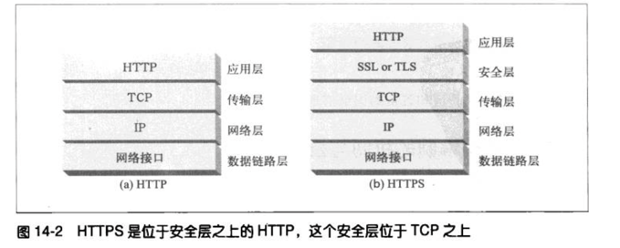
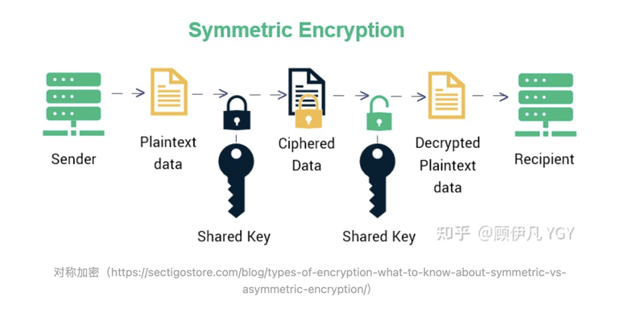
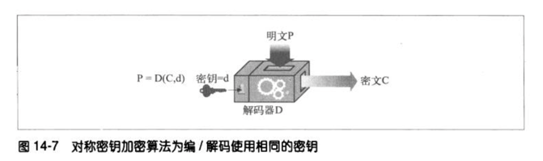

# 安全`HTTP `

使用`HTTPS`时，所有的`HTTP`请求和响应数据在发送到网络之前，都要进行加密。`HTTPS`在`HTTP`下面提供了一个传输级的密码安全层

## 对称秘钥加密技术

在编码时使用的秘钥值和解码时一样，统称为密钥k

在对称密钥加密技术中，发送端和接收端要共享相同的密钥k才能进行通信。发送端用共享的密钥来加密报文，并将得到的密文发送给客户端。接收端收到密文，并对其应用解密函数和相同的共享密钥，恢复出原始明文

### 建立共享密钥

对称密钥加密技术的缺点之一就是发送者和接受者在互相对话之前，一定要有一个共享的保密密钥

### 对称加密的问题

如果同学双方
