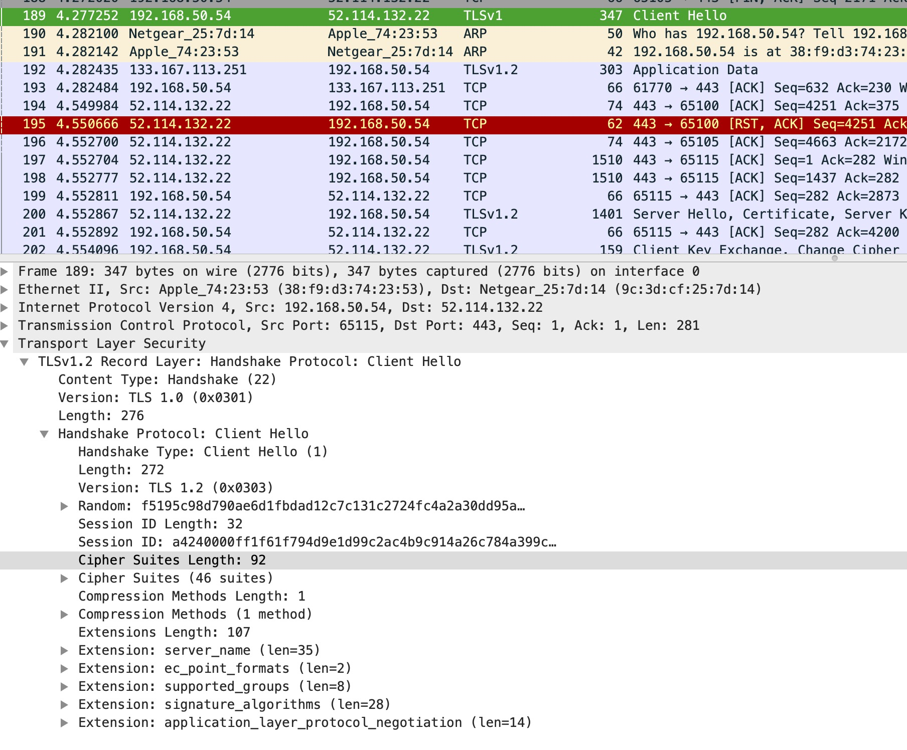
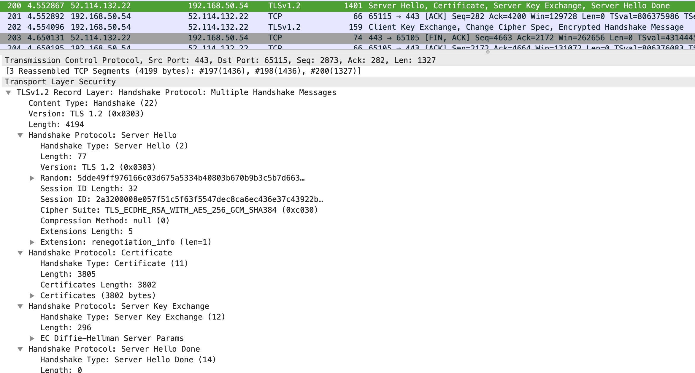
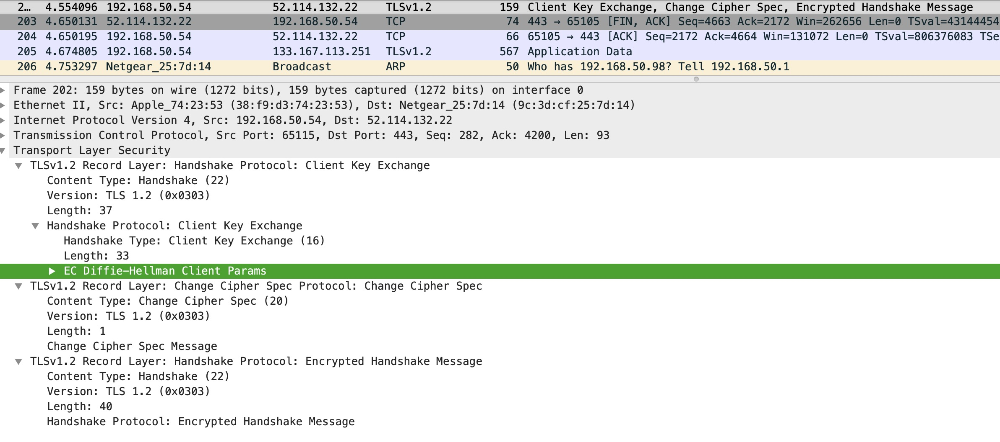

# `HTTPS`

使用`HTTP`进行通信，会产生以下安全风险
- 窃听风险：第三方可以获知通信内容
- 篡改风险：第三方可以修改通信内容
- 冒充风险：第三方可以冒充客户端或者服务端进行通信

`SSL/TLS`协议就是为了解决上面几种风险所设计的
- 所有信息都是**加密传输**，第三方无法窃听
- 具有**校验机制**，一旦被篡改，则会被快速发现
- 配备**身份证书**，防止身份被冒充

## 基本运行过程
`SSL/TLS`协议的基本思路是采用**公钥加密法**，也就是说，客户端会先向服务器端索要公钥，
然后用公钥加密信息，服务器收到密文后，再用私钥进行解密

上面的解决办法又会产生两个问题：
1. 如何保证公钥不会被篡改

方法：将公钥放在数字证书中，只要证书是可信的，那么公钥就是可信的

2. 公钥加密计算量比较大，如何减少消耗时间

方法：每一次对话，客户端与服务器端都会生成一个"对话密钥"(`session key`)，用它来加密信息。
由于"对话密钥"是对称加密的，所以运算速度很快，而服务器公钥只用于加密"对话密钥"本身，这样就减少了加密运算的消耗时间

#### 通信过程
- 客户端向服务器daunt索要并验证公钥 (握手阶段)
- 双方协商生成"对话密钥" (握手阶段)
- 双方采用"对话密钥"进行加密通信

## 握手过程（`DH`算法与`RSA`算法不同）

- 客户端发出请求（`clientHello`）
    - 首先客户端先向服务器发出加密通信的请求，这个请求被叫做`ClientHello`请求，在这一步客户端主要向服务器提供以下信息
    - 支持的版本协议，如`TLS 1.0`等等
    - 一个客户端生成的随机数，稍后用于生成"对话密钥"
    - 支持的加密算法
    - 支持的压缩方法
    
- 服务器回应(`SeverHello`)
    - 服务器收到客户端请求之后，向客户端发出回应，这个回应被叫做`SeverHello`，服务器的回应包含以下内容
    - 确认使用的加密通信协议版本，如果浏览器与服务器支持的版本不一致，则服务器关闭加密通信
    - 一个服务器生成的随机数，稍后用于生成"对话密钥"
    - 确认使用的加密方法
    - 服务器证书
    
- 客户端回应
    - 客户端收到回应之后，首先验证服务器证书，如果证书不是可信机构颁布或者其他问题，就会向访问者限制一个警告，
      由其选择是否要继续通信，如果证书没有问题，则会发送以下信息
    - 一个随机数，该随机数使用服务器公钥进行加密，防止被窃听
    - 编码改变通知，表示随后的信息都将用双方商定的加密方法和密钥放松
    - 客户端握手结束通知，表示客户端的握手阶段已经结束。这一项同时也是前面发送的所有内容的哈希值，用来提供服务器校验
    
- 服务器最后回应
    - 服务器收到客户端加密的第三个随机数后，会使用密钥进行解密，然后与前两个随机数共同生成"会话密钥"，会向客户端发送以下信息
    - 编码改变通知，表示随后的信息都将用双方商定的加密方法和密钥进行发送
    - 服务器握手结束通知，表示服务器的握手阶段已经结束
