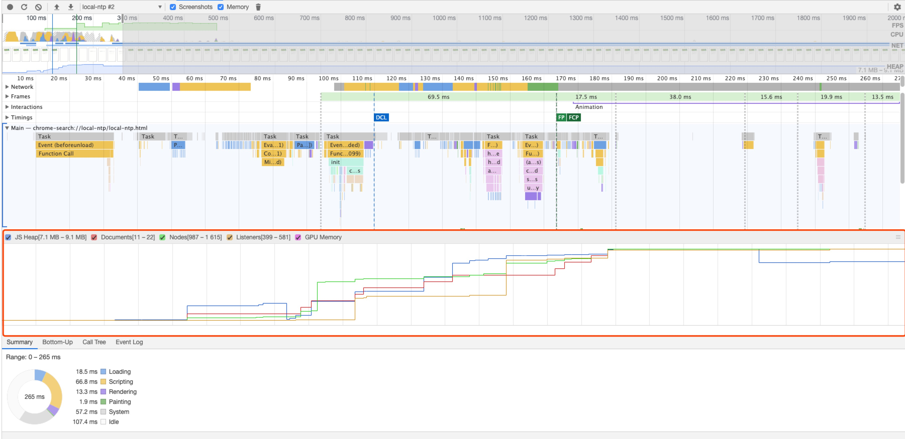

# 关于内存

## 内存空间

在`js`中数据的存储有两种方式，一种是栈存储，一种是堆存储
- 栈数据结构，后进先出
- 堆数据结构，是一种树状结构，它存取数据的方式与书架和书非常相似，只需要找到书的名字就可以取出书籍，而不需要将其上面或者下面的书取出来
- 队列，先进先出，是事件循环的基础结构

### 变量的存放
在`js`的内存中有堆和栈，存储不同的数据类型
- 基本类型：基本类型保存在栈中，因为这些类型在内存中占用固定大小的空间，通过值访问（`Undefined`, `Null`, `Boolean`, `Number`, `String`, `Symbol`）
- 引用类型：保存在堆内存中，由于引用类型的值的大小是不固定的，因此不能将其保存在栈内存中，但是内存地址的大小是固定的，因此将内容保存在堆内存中，将引用对象**地址**保存在栈内存中。当查询引用类型的变量时，先从栈中读取内存地址，然后再通过地址找到堆中的值

在计算机的数据结构中，栈比堆的运算速度快，`Object`是一个复杂的结构并且可扩展，数组与对象都可以进行增删改查。将他们放在堆中是为了不影响栈的效率

### 思考
问题1：
```javascript
var a = 20
var b = a
b = 30
// a的值？
```
问题2：
```javascript
var a = {name: a}
var b = a
b.name = 'b'
// a.name 的值?
```
问题3：
```javascript
var a = {name: 'a'}
var b = a
a = null
// b的值
```
解答：
- 第一个的答案是 20，因为`a`的值类型是基本类型，数据传递的是副本而非引用，所有`b`的值为20, 修改`b`的值与`a`无关
- 第二个答案是 `b`, `a`中的值类型为引用类型，数据传递的是对象的引用，也就是保存在堆中的地址，所以`b`指向与`a`同一个对象，修改该对象，所有引用了这个值的变量都会发生改变
- 第三个答案是`{name: 'a'}`，开始`a`保存一个引用对象的地址并将其复制给`b`，`a`与`b`指向同一个堆中的对象，当指向`a = null`后，就是将`a`中存储的引用地址变为了`null`，不再引用堆中的地址

### 内存空间管理
`javascript`内存的生命周期
- 分配所需要的内存
- 执行代码，内存进行读写操作
- 变量使用完毕，将内存进行释放
`javascript`有自动垃圾回收机制，浏览器最常使用的是**标记清除**的算法来找到哪些变量是不再继续使用的，将`a = null`就是使`a`失去对值得引用，这个引用的值会在下一次垃圾收集器执行的时候被回收释放

对于局部作用域中的变量，当函数执行完毕，局部变量也就没有存在的必要了，所以垃圾收集器很容易判断其中的变量并将其回收。但是全局变量在什么时候需要自动释放内存空间则很难判断，所以，在开发过程中，应该避免使用全局变量

### 思考题
```javascript
var a = {n: 1}
var b = a
a.x = a = {m: 2}
// b的值?a的值
```
答案： 
`b:{n: 1, x: {m: 2}}`，`a: {m:2}`
上面的代码重点在与执行顺序与操作符优先级，`.`操作符优先级最高，所以优先执行`a.x`，也就是向`a`中添加属性`x`，其值为`undefined`，此时`a`的值为`{n: 1, x: undefined}`, 然后按照表达式从右向左执行，也就是`a.x = (a = {m:2})`,先执行`a = {m:2}`将`a`指向其他对象，然后执行`a.x = a`，此时的`a`指向的是`{m:2}`，而`a.x`此时为`b.x`中的值，所以执行后`b.x`引用的`a`中的值，也就是`{m: 2}`

### 参考
[javaScript深入之内存空间详细图解](https://github.com/yygmind/blog/issues/14)

## 内存机制
前面提到基本类型数据保存在栈内存中，引用类型数据保存在堆内存中。但是对于实现将局部变量在上下文销毁后仍然保存下来，基于栈的实现显然是不合适的（因为与基于栈的结构相矛盾）。因此在这种情况下，上层作用域的闭包数据是通过动态分配内存的方式来实现的（基于“堆”实现），这种实现方式比基于栈的实现性能要低，但可以对函数变量进行分析根据情况是将数据存放在栈中还是堆中

### 内存回收
`javascript`有自动垃圾收集机制，垃圾收集器每隔一堆时间就会执行一次释放操作，找出不再继续使用的值，将其占用的内存进行释放，怎么判断一个值是否被使用呢？
- 局部变量：在局部作用域中，当函数执行完毕之后，局部变量也就没有存在的必要了，因此垃圾收集器很容易判断该值未被使用并将其进行回收
- 全局变量：由于全局作用域一直存在，其中的变量也会一直存在，所以不容易判断全局变量是否需要释放内存空间，所以在开发中首先要避免使用全局变量，其次应该手动将全局变量引用的值进行释放`object = null`

### 垃圾回收算法
- 引用计数
- 标记清除（常用）

#### 引用计数
引用计数算法定义一个对象是否引用是看一个对象是否有指向它的引用，如果没有其他对象指向它了，说明该对象已经不再需要了。但是引用计数有一个致命的缺点，就是循环引用
```javascript
function cycle () {
  var o1 = {}
  var o2 = {}
  o1.a = o2
  o2.a = o1
  return "cycle refernce"
}
cycle()
```
`cycle`在执行完成之后，实际上`o1`与`o2`已经不再需要了，但是根据引用计数的原则，它们之间的互相引用仍然存在，因此这部分不会被内存回收，所以现代浏览器不再使用这个方法。但是在`IE`浏览器中依然被使用
```javascript
var div = document.createElement("div")
div.onclick = function (e) {
  console.log('div', e.target)
}
```
上面的写法在`js`中的代码中很常见，变量`div`有事件处理函数的引用，同时，事件处理函数也有`div`的引用，因此`div`所引用的节点在事件处理函数中可以被访问，循环引用就出现了

#### 标记清除
标记清除将**不再使用的对象**定义为**无法到达的对象**，就是从根部（全局对象`window`）出发定时扫描内存中的对象，凡是能够从根部到达的对象则保留，否则标记为清除，下次将其回收

无法到达的对象包含了没有引用对象的概念，但反之不一定成立

所以对现在的主流浏览器，只需要切断需要回收的对象与根之间的联系。最常见的泄露一般都与`DOM`元素绑定有关
```javascript
var message = document.createElement("div")
displayList.appendChild(message)
displayList.removeAllChildren()
```
上面的代码中，创建的`div`元素虽然已经从`DOM`树中清除，但变量`message`还保存着对它的引用，所以`div`元素就会一直保存在内存中，需要进行手动释放或者使用`WeakMap`

### 内存泄露
程序的运行需要内存，只要程序提出要求，操作系统或者运行时`runtime`就必要要供给内存。对于持续运行的服务进程，必须及时释放不再使用到的内存。否则，内存占用会越来越高

#### 识别方法
1. 开发者工具
   - 打开`chrome`开发者工具，点击`Performance`
   - 点击左上角录制按钮
   - 在页面上进行各种操作，模拟用户使用情况
   - 操作完成之后，点击对话框`stop`按钮，面板上就会显示这段时间的网页性能情况，其中包含内存占用

   

2. 命令行
  命令行可以使用`Node`提供的`process.memoryUsage`方法
  ```javascript
  console.log(process.memoryUsage());
  // { rss: 27709440,
  //  heapTotal: 5685248,
  //  heapUsed: 3449392,
  //  external: 8772 }
  ```
  - `rss`: `resident set size` 所有内存占用，包括指令区和堆栈
  - `heapTotal`: "堆"占用的内存，包含使用以及未使用的
  - `heapUsed`: "堆"使用内存
  - `external`: `v8`引擎内部`c++`对象占用的对象

### `WeakMap`
及时的清除引用，释放内存非常重要，但经常很容易忽视。那么最好有一种方法，在新建引用的时候就声明，哪些引用必须手动清除，哪些引用可以忽略不计，当其他的引用释放后，垃圾回收机制就可以释放内存。这样就能大大减少程序员的负担，只需要清除主要的引用就可以了

`ES6`为此新加了两种数据结构`WeakSet`和`WeakMap`。它们对于值得引用都是不计入垃圾回收机制的，前面的`Weak`表示为"弱引用"
```javascript
const wm = new WeakMap()
const element = document.getElementById('example')
wm.set(element, 'some information')
wm.get(element)
```
上面代码中`element`变量与元素之间就是弱引用，如果没有其他变量引用该`DOM`元素，那么该节点所占用的内存就会被垃圾回收机制释放，`WeakMap`保存的这个键值对，也会自动消失


### 参考
- [深入理解JavaScript系列（16）：闭包（Closures）](https://www.cnblogs.com/TomXu/archive/2012/01/31/2330252.html)
- [JavaScript 内存泄漏教程](http://www.ruanyifeng.com/blog/2017/04/memory-leak.html)
- [JavaScript深入之带你走进内存机制](https://github.com/yygmind/blog/issues/15)


## 常见内存泄露
常见的垃圾回收算法为**标记清除**算法，算法由以下几步组成：
- 垃圾回收期创建了一个`roots`列表，该`roots`通常是代码中全局变量的引用，在浏览器端，`window`对象就是一个全局变量，被当作`root`。`window`对象总是存在的，因此垃圾回收器可以检查它和它的所有子对象是否存在，存在则不是垃圾，不存在则是垃圾
- 所有的`roots`被检查和标记为激活（不是垃圾）。所有的子对象也被递归进行检查，从`root`开始，对象可达，则不是垃圾
- 所有未被标记的内存会被当做垃圾，被垃圾收集器进行回收释放

**常见内存泄露**
- 全局变量：无意创建的全局变量
```javascript
function foo () {
  bar = 'this is a global variable' // 不使用var进行声明，会创建全局变量
}
function foo () {
  this.bar = 'maybe a global variable'
}
foo() // 直接调用，内部 this 执行 window，相当于创建了一个全局变量
```
解决办法：
  - 在`javascript`文件头部加上`use strict`，使用严格模式避免意外的全局变量
  - 使用全局变量存储大量数据的时候，确保用完之后使用`null`将其释放

- 被遗忘的计时器或回调函数
```javascript
setInterval(function () {
  var node = document.getElementById('node')
  if (node) {
    node.innerHTML = JSON.stringify(data)
  }
}, 1000)
```
上面的例子中，在节点`node`或者是数据不再需要的时候，定时器依然会指向这些数据。即使`node`节点被移除，定时器仍旧存在，依赖也就没有办法被回收，除非清除定时器

- 脱离`DOM`的引用
将`DOM`节点保存在对象或者数组中，此时，同样的`DOM`元素存在两个引用，一个在`DOM`树中，另一个保存在对象或者数组中。如果不需要，需要将两个都清除
```javascript
var elements = {
  button: document.getElementById('button')
  image: document.getElementById('image')
}
function removeButton () {
  document.body.removeChild(document.getElementById('button'))
  // 删除掉DOM树中对元素的引用，但仍有一个引用保存在elements.button中，需要手动将其清除
}
```

- 闭包
  闭包可以访问父级作用域中的变量，被闭包内引用的变量会一直保存在堆内存中，不使用后请将其释放

思考题
- 从内存看`null`与`undefined`本质的区别是什么？
  - `null`表示一个“无”的对象
  - `undefined`表示“缺少值”，就是此处应该有一个值，但是没有定义，也就是一个“无”的原始值


## 参考
- [JS解惑-undefined和null](https://github.com/sunmaobin/sunmaobin.github.io/issues/17)
- [4类 JavaScript 内存泄漏及如何避免](https://jinlong.github.io/2016/05/01/4-Types-of-Memory-Leaks-in-JavaScript-and-How-to-Get-Rid-Of-Them/)