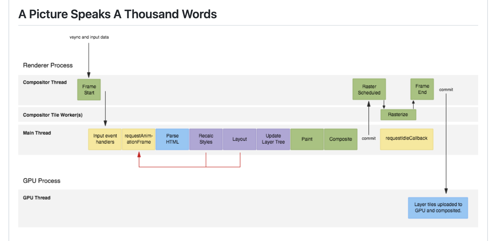

# 【DONING】react fiber

Status: 计划
Tag: study
优先级: 高

# React 源码学习之 fiber

### 面试题： 请说一下React的渲染流程

- 解题思路
  - 宏观的设计理念
  - 清晰描述关键原理，抽象和具象相结合
  - 结合工程实践以及工作成功
- 设计理念
  - 跨平台：虚拟DOM
  - 快速响应：异步可中断 + 增量更新
- 性能瓶颈
  - js任务执行时间过长：浏览器刷新频率大约为60Hz，大概是16.6ms渲染一次，而在浏览器中js线程和渲染线程是**互斥的**，所以如果js线程执行任务时间超过16.6ms的话，就会导致掉帧，卡顿。解决办法：利用空闲时间进行更新，不影响需要进行的渲染
  - 解决办法：将耗时任务切分成一个个小任务，使用**时间切片**的方式将其分布在每一帧中

### 屏幕刷新率

- 目前大多数设备的屏幕刷新率为60次/秒
- 浏览器渲染动画或页面的每一帧的速率需要跟设备屏幕保持一致
- 页面是一帧一帧绘制出来的，当每秒绘制的帧数（FPS）达到60ms时，页面是流程的，小于这个值的时候，用户会感觉到卡顿
- 每个帧的预算时间是16.66毫秒（1/60）
- 1秒60帧，则每一帧的时间大概是16ms，所以我们写代码时应该尽量不让一帧的工作量超过16ms

### 帧

- 每个帧的开头包括样式计算，布局和绘制
- js执行的js引擎和页面渲染引擎在同一个渲染进程，GUI渲染和js执行两者是互斥的
- 如果某个任务执行时间过长，浏览器会推迟渲染

### requestIdleCallBack

- 先执行高优先级任务，比如用户输入响应、渲染、布局、绘制、资源加载等
- 在一帧内高优先级任务执行完成之后，将剩余时间分配给requestIdleCallback函数
- requestIdleCallback执行完回调函数之后，主动归还控制器给浏览器进行重新调度（不归还会造成卡顿）
